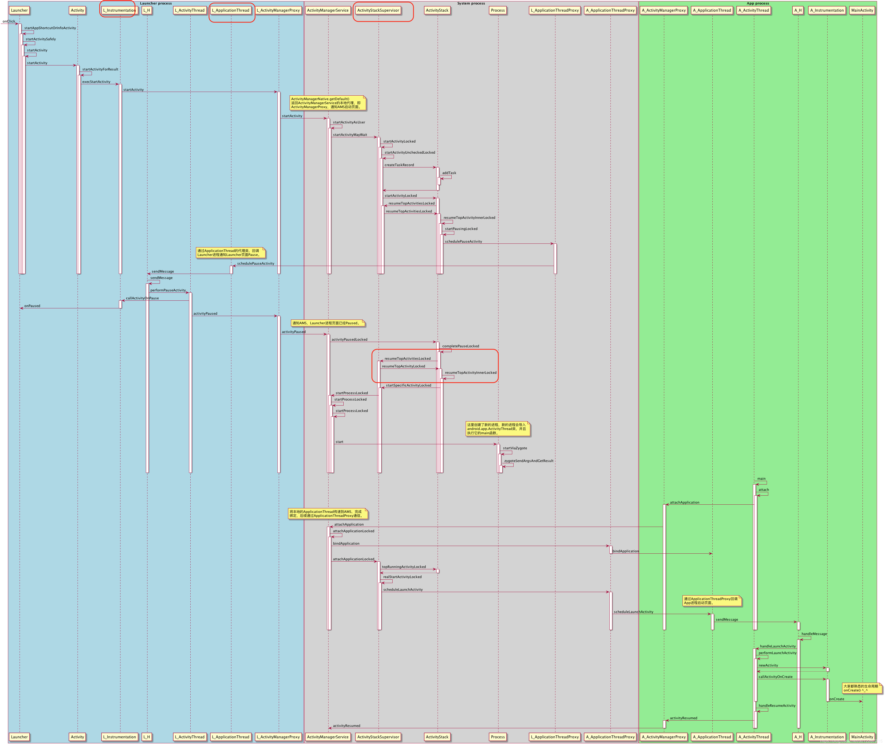
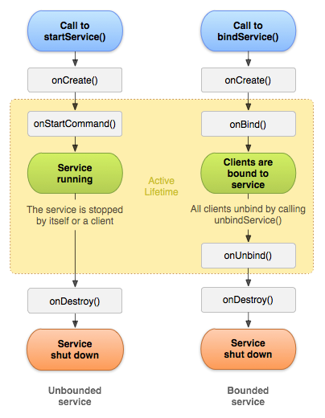

本文档按照四大组件，常见Android基础问题，高频面试问题顺序进行梳理。

# 一.Activity相关
## 1.Activity的生命周期
(1) 正常Activity的生命周期:

(2) 异常生命周期：

什么是异常生命周期呢？例如屏幕发生旋转或者语言发生变化时，activity会被重新create，生命周期会重走。这里涉及到一个状态的保存与恢复，在Activity中自带一个数据保存与恢复的函数——onSaveInstanceState()、onRestoreInstanceState()这两个函数并不属于Activity的生命周期，onSaveInstanceState()调用的时机在onStop()之前，onRestoreInstanceState()调用的时机在onStart之后。

(3) onSaveInstanceState()与onRestoreInstanceState()的实现

// TODO
## 2.Activity的启动流程

(1) 涉及重要的类

- ActivityStack：Activity在AMS的栈管理，用来记录已经启动的Activity的先后关系，状态信息等。通过ActivityStack决定是否需要启动新的进程。
- ActivitySupervisor：管理 activity 任务栈
- ActivityThread：ActivityThread 运行在UI线程（主线程），App的真正入口。
- ApplicationThread：用来实现AMS和ActivityThread之间的交互。
- ApplicationThreadProxy：ApplicationThread 在服务端的代理。AMS就是通过该代理与ActivityThread进行通信的。
- IActivityManager：继承与IInterface接口，抽象出跨进程通信需要实现的功能
- AMN：运行在server端（SystemServer进程）。实现了Binder类，具体功能由子类AMS实现。
- AMS：AMN的子类，负责管理四大组件和进程，包括生命周期和状态切换。AMS因为要和ui交互，所以极其复杂，涉及window。
- AMP：AMS的client端代理（app进程）。了解Binder知识可以比较容易理解server端的stub和client端的proxy。AMP和AMS通过Binder通信。
- Instrumentation：仪表盘，负责调用Activity和Application生命周期。测试用到这个类比较多。
- ActivityStackSupervisor
负责所有Activity栈的管理。内部管理了mHomeStack、mFocusedStack和mLastFocusedStack三个Activity栈。其中，mHomeStack管理的是Launcher相关的Activity栈；mFocusedStack管理的是当前显示在前台Activity的Activity栈；mLastFocusedStack管理的是上一次显示在前台Activity的Activity栈。

(2) 从Launcher启动一个应用流程简要流程

本流程从此文章借鉴，如果需要更详细的流程，请转至此文章
> https://blog.csdn.net/u012267215/article/details/91406211

先上一张整体的流程图

第一阶段： Launcher通知AMS要启动新的Activity（在Launcher所在的进程执行）

- Launcher.startActivitySafely //首先Launcher发起启动Activity的请求
- Activity.startActivity
- Activity.startActivityForResult
- Instrumentation.execStartActivity //交由Instrumentation代为发起请求
- ActivityManager.getService().startActivity //通过- - - - IActivityManagerSingleton.get()得到一个AMP代理对象
- ActivityManagerProxy.startActivity //通过AMP代理通知AMS启动activity

第二阶段：AMS先校验一下Activity的正确性，如果正确的话，会暂存一下Activity的信息。然后，AMS会通知Launcher程序pause Activity（在AMS所在进程执行）

- ActivityManagerService.startActivity
- ActivityManagerService.startActivityAsUser
- ActivityStackSupervisor.startActivityMayWait
- ActivityStackSupervisor.startActivityLocked ：检查有没有在AndroidManifest中注册
- ActivityStackSupervisor.startActivityUncheckedLocked
- ActivityStack.startActivityLocked ：判断是否需要创建一个新的任务来启动Activity。
- ActivityStack.resumeTopActivityLocked ：获取栈顶的activity，并通知Launcher应该pause掉这个Activity以便启动新的activity。
- ActivityStack.startPausingLocked
- ApplicationThreadProxy.schedulePauseActivity

第三阶段： pause Launcher的Activity，并通知AMS已经paused（在Launcher所在进程执行）

ApplicationThread.schedulePauseActivity
ActivityThread.queueOrSendMessage
H.handleMessage
ActivityThread.handlePauseActivity
ActivityManagerProxy.activityPaused

第四阶段：检查activity所在进程是否存在，如果存在，就直接通知这个进程，在该进程中启动Activity；不存在的话，会调用Process.start创建一个新进程（执行在AMS进程）

- ActivityManagerService.activityPaused
- ActivityStack.activityPaused
- ActivityStack.completePauseLocked
- ActivityStack.resumeTopActivityLocked
- ActivityStack.startSpecificActivityLocked
- ActivityManagerService.startProcessLocked
- Process.start //在这里创建了新进程，新的进程会导入-
- ActivityThread类，并执行它的main函数

第五阶段： 创建ActivityThread实例，执行一些初始化操作，并绑定Application。如果Application不存在，会调用LoadedApk.makeApplication创建一个新的Application对象。之后进入Loop循环。（执行在新创建的app进程）

- ActivityThread.main
- ActivityThread.attach(false) //声明不是系统进程
- ActivityManagerProxy.attachApplication

第六阶段：处理新的应用进程发出的创建进程完成的通信请求，并通知新应用程序进程启动目标Activity组件（执行在AMS进程）

- ActivityManagerService.attachApplication //AMS绑定本地ApplicationThread对象，后续通过ApplicationThreadProxy来通信。
- ActivityManagerService.attachApplicationLocked
- ActivityStack.realStartActivityLocked //真正要启动Activity了！
- ApplicationThreadProxy.scheduleLaunchActivity //AMS通过ATP通知app进程启动Activity

第七阶段： 加载MainActivity类，调用onCreate声明周期方法（执行在新启动的app进程）

- ApplicationThread.scheduleLaunchActivity //ApplicationThread发消息给AT
- ActivityThread.queueOrSendMessage
- H.handleMessage //AT的Handler来处理接收到的LAUNCH_ACTIVITY的消息
- ActivityThread.handleLaunchActivity
- ActivityThread.performLaunchActivity
- Instrumentation.newActivity //调用Instrumentation类来新建一个Activity对象
- Instrumentation.callActivityOnCreate
- MainActivity.onCreate
- ActivityThread.handleResumeActivity
- AMP.activityResumed
- AMS.activityResumed(AMS进程)

## 3.Activity的启动模式
Activity有四种启动模式分别是：

(1) Standard

每启动一个activity会创建一个实例，不管存不存在

(2) SingleTop

如果新Activity已经位于任务栈顶，那么此activity不会重新创建，并且onCreate onStart生命周期不会再次调用，onNewIntent方法会调用,如果此Activity位于非栈顶位置，那么再此activity以上的activity都会出栈

(3) SingleTask

只要任务栈中存在就不会多次创建

(4) SingleInstance

一个activity对应一个任务栈

补充：TaskAffinity——任务相关性

(1) 最常见的用法就是TaskAffinity与SingleTask一起使用，待启动Activty会启动再名字与TaskAffinity相同的任务栈

(2) TaskAffinity也可以和allTaskReparenting结合使用，这样可以将Activity从启动的任务栈迁移到另外一个任务栈，且迁移前后的任务栈不相同。

# 二.Service相关
## 1.Service的生命周期
由于Service有两种启动方式，因此Service也有两种生命周期：

A. startService启动

B. bindService启动

## 2.Service的启动流程

// TODO

## 3.Service相关

**(1) IntentService**

IntentService是一种特殊的Service，它继承了Service并且它是一个抽象类，因此必须创建它的子类才能使用IntentService。

**原理**

在实现上，IntentService封装了HandlerThread和Handler。当IntentService被第一次启动时，它的onCreate()方法会被调用，onCreat()方法会创建一个HandlerThread，然后使用它的Looper来构造一个Handler对象mServiceHandler，这样通过mServiceHandler发送的消息最终都会在HandlerThread中执行。

生成一个默认的且与主线程互相独立的工作者线程来执行所有传送至onStartCommand()方法的Intetnt。

生成一个工作队列来传送Intent对象给onHandleIntent()方法，同一时刻只传送一个Intent对象，这样一来，你就不必担心多线程的问题。在所有的请求(Intent)都被执行完以后会自动停止服务，所以，你不需要自己去调用stopSelf()方法来停止。

该服务提供了一个onBind()方法的默认实现，它返回null。

提供了一个onStartCommand()方法的默认实现，它将Intent先传送至工作队列，然后从工作队列中每次取出一个传送至onHandleIntent()方法，在该方法中对Intent做相应的处理。

为什么在mServiceHandler的handleMessage()回调方法中执行完onHandlerIntent()方法后要使用带参数的stopSelf()方法？

因为stopSelf()方法会立即停止服务，而stopSelf（int startId）会等待所有的消息都处理完毕后才终止服务，一般来说，stopSelf(int startId)在尝试停止服务之前会判断最近启动服务的次数是否和startId相等，如果相等就立刻停止服务，不相等则不停止服务。

**(2) 直接在Activity中创建一个thread跟在service中创建一个thread之间的区别？**

在Activity中被创建：该Thread的就是为这个Activity服务的，完成这个特定的Activity交代的任务，主动通知该Activity一些消息和事件，Activity销毁后，该Thread也没有存活的意义了。

在Service中被创建：这是保证最长生命周期的Thread的唯一方式，只要整个Service不退出，Thread就可以一直在后台执行，一般在Service的onCreate()中创建，在onDestroy()中销毁。所以，在Service中创建的Thread，适合长期执行一些独立于APP的后台任务，比较常见的就是：在Service中保持与服务器端的长连接。